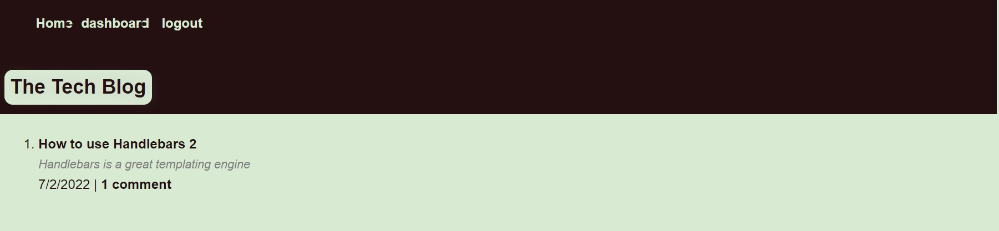

# The Tech Blog
 

## Description
This is an MVC tech blog application. It allows readers to read blog posts from other readers and comment on their posts. It allows users the ability to create, edit and delete blogs via their dashboard. 

## Technologies Used
* Node.js
* Express.js
* MySQL2
* Sequelize
* dotenv
* express-handlebars
* bcrypt
* express-session
* connect-session-sequelize
* heroku

### Created by
Angel Van de Feniks
